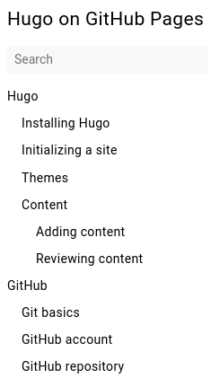

# Content

Hugo accepts a number of content formats. The content of this site is written in Markdown.

## Markdown
Markdown is a lightweight markup language. It is easy to learn and easy to use, but its capabilities are limited.

You can learn Markdown from [this tutorial from GitHub](https://guides.github.com/features/mastering-markdown/).  
Hugo uses an interpreter compliant with the same Markdown flavor that GitHub uses.

## Content organization
The easiest way to organize content in Hugo is by manipulating the directory structure and the `weight` metadata of articles.
### Directory structure
By default, content is stored in the `content` folder in your repository. Themes may require various layouts for the files in that folder. For example, the "book" theme, used to generate this site, by default requires the content to be placed in the `content/docs` folder.

When you add content files, their position in the directory structure affects their kind and position in the table of contents.

This example shows a part of this site's directory structure:
```
.
└── content
    └── docs
        └── hugo
            _index.md
            initialize.md
            install.md
            themes.md
            articles
            └── _index.md //this is the article you are reading now
                add.md
                review.md
                _gfx
                └── tocExample.png
        └── github
            ...
        ...
```

In the `content/docs/hugo/articles` folder, the `_index.md` file is the main article of the section. In the table of contents, it is the "parent" of the other articles inside the folder.  
  

In the Hugo documentation, this is called a *page bundle*.  

**NOTE:** the index file **must** be named `_index.md`, including the underscore. Without the underscore, the page becomes a *leaf bundle*. Leaf bundles are not used for creating this site.

Page bundles can be used to create logical structures and store additional resources, such as images, closer to the content where they are used.  
In the folder structure mentioned earlier, the article you are reading now is a part of another page bundle. The index page of the larger page bundle is [this article](/docs/hugo).

For more details, see the [Hugo documentaiton](https://gohugo.io/content-management/organization/).

### Article weight
The `weight` metadata is explained [here](#weight).

## Article metadata
The metadata is a block of YAML-formatted data at the beginning of a Markdown file. The example shows the first lines of this article's source file:
```
---
title: "Content"
weight: 20
description: "Learn to manage content structures in Hugo"
---
# Content

Hugo accepts a number of content formats. The content of this site is written in Markdown.
```

The two main purposes of metadata are:
- Providing information to Hugo when generating a site.
- Providing information to search engines.

Hugo does not treat any metadata as obligatory. Omitting the metadata entirely does not cause a build error. However, it is good practice to add at least a title and a description.

You can add custom metadata:
```
---
title: "Content"
weight: 20
description: "Short description"
customParam: "string"
customArrayParam:
    - "string"
    - "string"
---
```
This can be useful for creating custom shortcodes and partials. For example, you can create a shortcode that uses metadata to build complex relationship maps between articles.

### Title
Visible in the table of contents, the title of the browser tab, and the search engine.
### Description
Visible in the search engine and some tables of contents, depending on the theme.
### Weight
Used to arrange the order of articles in the table of contents. Articles with the lowest weight are displayed first.  
Weight works in the scope of a single section and does not affect sub-sections.  
**Example:**  
  
In the table of contents in the screenshot, the weight of "Initializing a site":
- does not interact in any way with the weight of "Adding content" or "GitHub account". 
- interacts with the weight of "Installing Hugo", "Themes", and "Content".

**TIP:** When adding weight to articles, do not increment the value by `1`. Use a larger value, such as `5` or `10`. Thanks to this, when you add an article in the future, you will not need to modify the weight of other articles in the section.  
**Example**.
1. "Article A" has a weight of 5.
2. "Article B" has a weight of 10.
3. A month later, "Article C" is added. The weight is set to 8.

In result, "Article C" is placed in the table of contents between A and B without any further modifications.  
If A had a weight of 1 and B had a weight of 2, you would have to change the weight of B to 3. In a structure with more articles, this would generate unnecessary workload.
